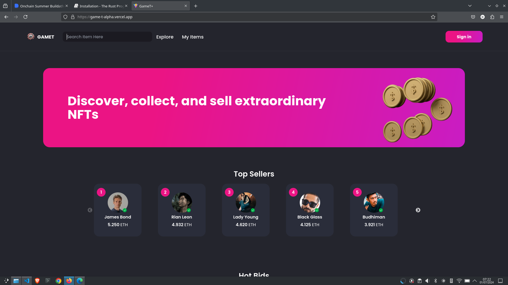
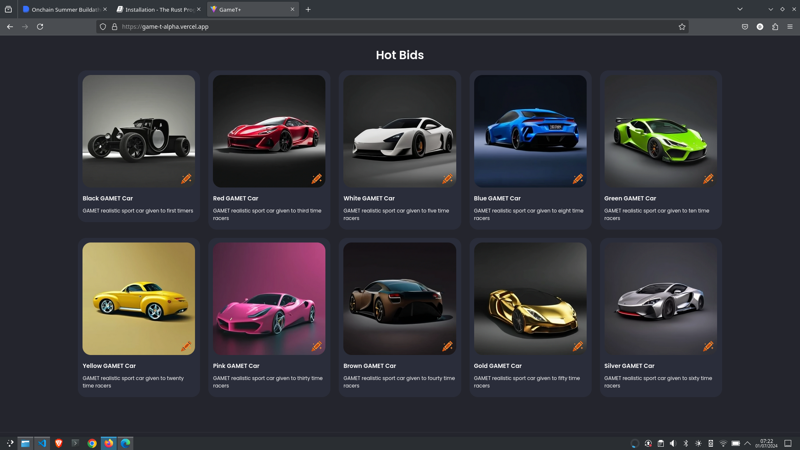
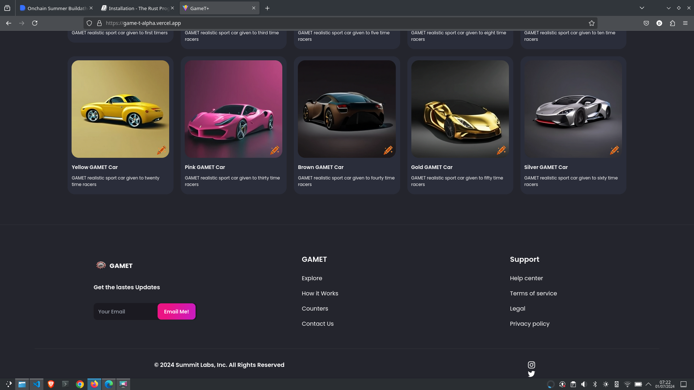

# GameT MArketplace Repo

This repository contains the implementation of the OnchainKit and the code for the GameT online Marketplace that connects with the GameT gameplay.

This repository frontend is hosted at [game-t-alpha.vercel.app](https://game-t-alpha.vercel.app).

To know more about GameT - the game where speed meets blockchain, go to the detailed documentation of GameT and how this Marketplace is used which can be found [here](https://github.com/MayowaObisesan/gamet/blob/main/README.md).

## Screenshots of the Marketplace

